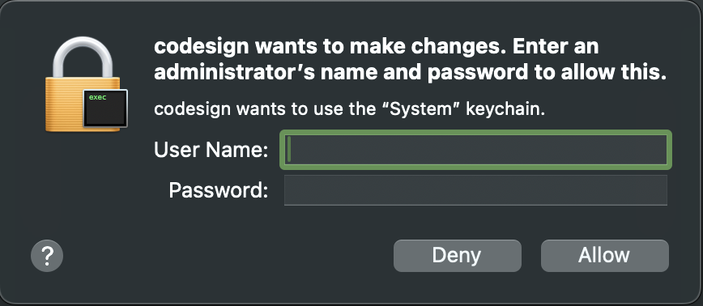

### Script for automatically allowing singing 

you just need to fill your username and password in `.env` file and run `main.py`, it will automatically fill your password and Allow it repeatedly



it will quit automatically as well when there is no popups appears in a few seconds

---

### Run

```shell
pip3 install
```

> Then fill your username and password in `.env` file

```shell
python3 main.py
```


### Example:

